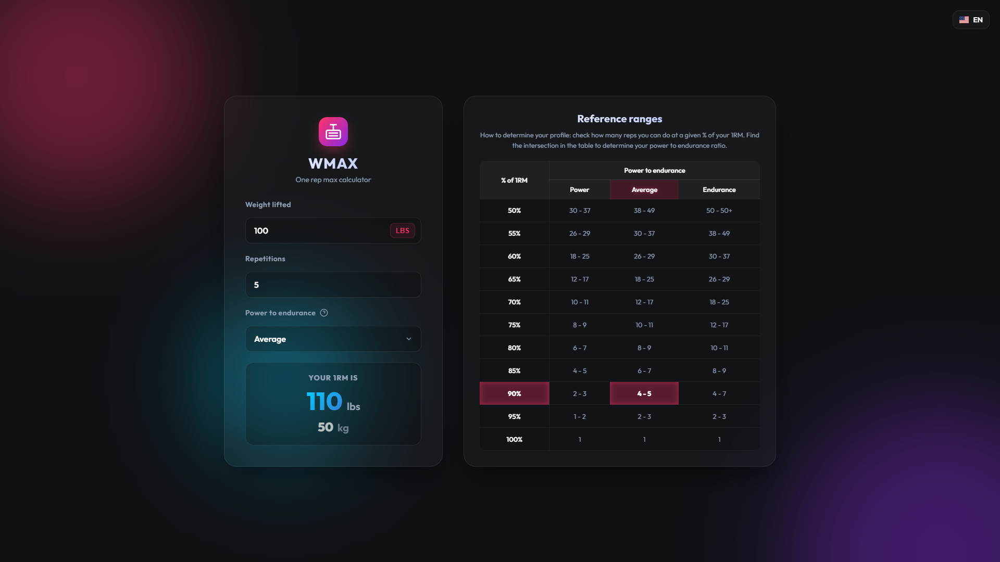
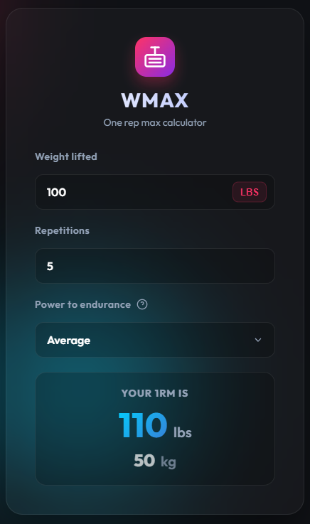
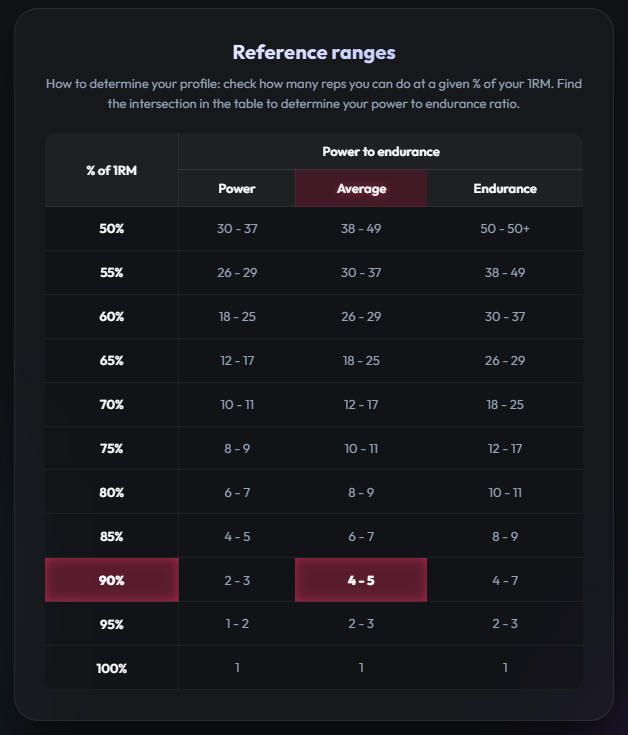

# WMAX - Maximum Weight Calculator

WMAX is a highly specialized web application and standalone utility for calculating your One Repetition Maximum (1RM). It's built with modern web aesthetics in mind, featuring glassmorphism and an animated design, backed by a robust, fully-tested FastAPI core.

---

## Features
- **Accurate 1RM calculation**: Advanced algorithm utilizing specific power to endurance ratios (Power, Average, Endurance).
- **FastAPI backend**: Lightning-fast endpoints with Pydantic data validation.
- **Modern UI/UX**: Premium aesthetic with micro-animations, glassmorphism, and responsive design.
- **Standalone executables**: Packaged via PyInstaller into single executable files for Windows, macOS, and Linux. No installation required.

---

## Screenshots

<div align="center">
  
  <br /><br />
  <strong>Main interface:</strong> <em>This shows the overall look of the web application right after opening. It features a modern, dark glassmorphism design with an interactive language selector and background animations.</em>
</div>
<br />
<br />

<div align="center">
  
  <br /><br />
  <strong>Calculation & results:</strong> <em>This shows the input form alongside the dynamically calculated 1RM result. Results update in real-time as you type, with an animated counter and both metric (kg) and imperial (lbs) units.</em>
</div>
<br />
<br />

<div align="center">
  
  <br /><br />
  <strong>Reference table:</strong> <em>This screenshot displays the help table popup that explains the mathematics behind the power to endurance ratios. It automatically highlights the column and row based on your current inputs.</em>
</div>

---

## Getting started

### Development

The project uses `uv` for lightning-fast dependency management.

1. **Install uv**:
   ```bash
   curl -LsSf https://astral.sh/uv/install.sh | sh
   ```
2. **Install dependencies**:
   ```bash
   uv sync
   ```
3. **Run the server**:
   ```bash
   uv run python main.py
   ```
   You can optionally specify a custom host and port:
   ```bash
   uv run python main.py --host 0.0.0.0 --port 9000
   ```
4. **Visit**: `http://127.0.0.1:8372`

### Running the executable

Simply head over to the [Releases](../../releases) page and download the executable for your platform.
Double-click it (or run it from the terminal), and it will automatically spawn a local web server at `http://127.0.0.1:8372`.

---

## Mathematical model

The formula used dynamically estimates max capacity using a scale dependent on what type of lifter you are:
- **Power** (Fast-twitch dominant)
- **Average** (Balanced fibers)
- **Endurance** (Slow-twitch dominant)

Each mode scales reps to specific percentages of 1RM uniquely to provide realistic expectations based on individual genetic predispositions.

### Calculation Formula

The calculator determines your baseline maximum by looking up your reps and profile in the reference matrix, identifying the matched **% of 1RM** ($P$), and then applying:

$$ \text{1RM} = \frac{\text{Weight Lifted}}{(P / 100)} $$

For weights over 50kg (or 110lbs), the final result is seamlessly rounded to the nearest standard 2.5kg interval.